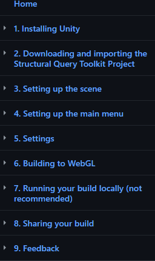

# Structural Geology Query Toolkit Instructions

|  |  |
| :----------------------------------------------------------: | :----------------------------------------------------------: |

[TODO insert description of this project]

This guide assumes you are a newcomer to the Unity game engine. 

### To learn how to build your own project, use the [wiki](https://github.com/UWRealityLab/StructuralQueryToolkit/wiki)

