# Structural Geology Query Toolkit

## Overview

[TODO insert description of this project]

This guide assumes you are a newcomer to the Unity game engine. 

## Installing Unity

### Download Unity Hub

Unity Hub is an application where you can manage your Unity projects and Unity editors.

https://store.unity.com/download?ref=personal 

You will also need to create an account and obtain a free personal license. These can be done in the Unity Hub application.

### Adding a new Unity version

After installing install Unity Hub, you will need to download an actual Unity editor to go with it. This project was last updated using Unity **2020.2.2**, and we strongly recommend using the same version. 

Go to the [Unity Archive Site](https://unity3d.com/get-unity/download/archive) and select the "Unity Hub" option.

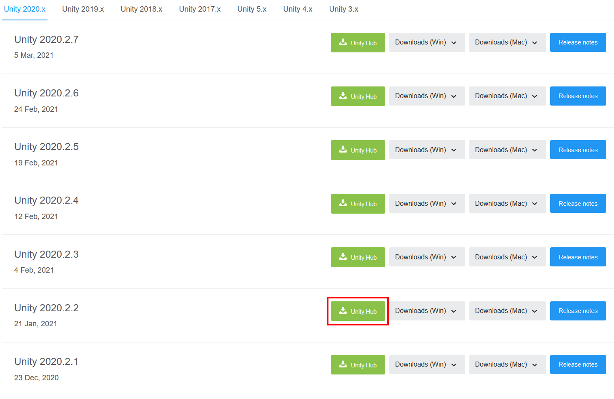

### Adding the WebGL module to your Unity version

In Unity Hub, you will see this popup. Check the "WebGL Build Support" to be able to build on WebGL platforms.

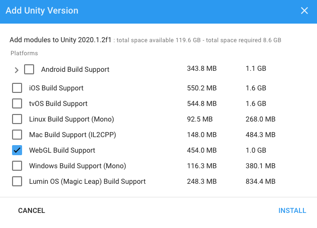

## Downloading the Structural Query Toolkit Project

If you are unfamiliar with Git, we recommend you download and extract the ZIP file of the project, shown below:

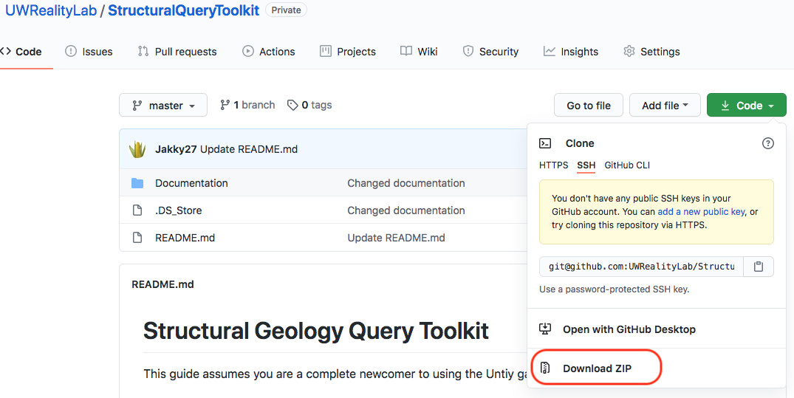

## Importing the project

Once you have extracted the zip file, open Unity Hub to open the project. 

Simply click the on the project folder and click "open."

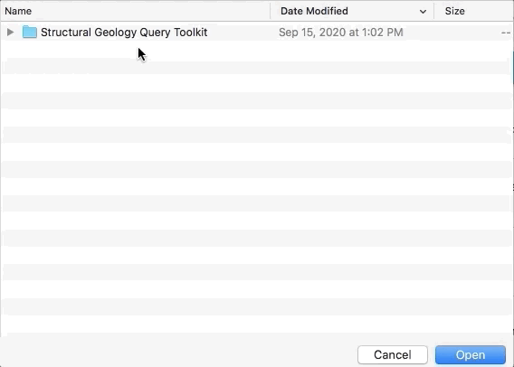

**Note:** importing this project may take several minutes. Once it has finished and you see the Unity editor, proceed below.

## Setting up the scene

For this guide, you will only use these four folders:

- **_Model** is where you will place your model's mesh and texture. This folder also contains an unfinished **material** called "Model Material" that you will later use.
- **_Toolkit Models** contains objects that you may add freely to your project. They are mostly for decoration.
- **_Toolkit Prefabs** contains optional objects you can place into your scene. For example, the **Altitude Marker** is used to describe the elevation of your model.
- **Scenes** contains **scenes**, which are essentially different game levels, or rooms. There is the **Field Scene** where users can interact with your model(s), and there is a **Main Menu** scene, which acts as an player introduction to your project. The main menu is covered later.

### Open the field scene

After importing the package, open the scene called "Field Scene" inside "Assets/Scenes"

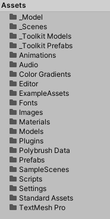

This scene is where you will insert your own model(s) to be used in-game.

By default, we've included a sample scene that you play around with! Feel free to either keep or swap out parts of this sample with your own objects.

This guide will demonstrate replacing this scene with a model of our own. 

### Hiding the user interface for convenience

When you open Toolkit scene, you will notice a rectangle is obstructing the part of the view. This is actually the user interface. We recommend hiding these obstructions in your editor, though this is merely for convenience and has no impact on the final build. 

Under the "USER INTERFACE," simply click on the hide toggle.

### Setting the aspect ratio for your editor play mode

This project's user interface was only designed to accustom 16:9 and 16:10 screen aspect ratios. Other aspect ratio may lead to a poor user experience. 

**Note:** this does not affect the final build of the project, where its default resolution is defined elsewhere. This simply gives you a better preview of the in-game look in the Unity editor. In particular, the in-game UI will match what the final build will look like.

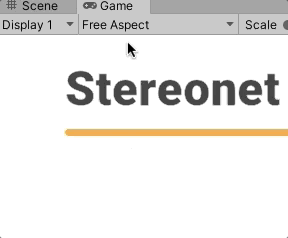

### Entering play mode

To enter play mode, press the play button.

 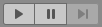

**Always exit play mode before making adjustments!** All changes you make to scene will revert back when you exit play mode.

### Importing your model's mesh and texture

Open the **_Model** folder and drag and drop your model's mesh and texture into it

### Importing your model's texture

Open the **_Model** folder and drag and drop your model's texture into it

You'll need to import your models' textures to the project. Simply drag your image texture in your project window.

[TODO]

In Unity, select your texture and adjust its import settings. For reference, here is our import setting for our Whaleback texture. The most important setting is **Max Size**, where you should set it to your image's resolution. Values lower will reduce the fidelity of your texture, and any values higher will have no impact.

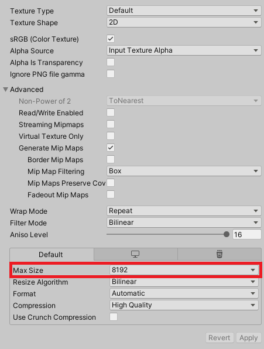

We have already made a **material** file that you will insert your texture in it.

1. Select the material file
2. Drag the texture file into its input next to "Base Color"

[TODO]

### Adding your model to your scene

In your "project" window, simply drag your model's mesh into the "scene" window.

[TODO gif]

The model you placed will initially have its pivot point in the origin point, so you should reset its **transform** by zeroing its x/y/z positions

[TODO gif]

### Change the tag of your model to "Terrain"

To make your model interactable with our tools, you need to mark objects with the "Terrain" tag. Objects will also need a collider component. 

[TODO gif]

### Add the "Mesh Collider" component to your model

Adding a collider component to your model is needed to make it interactable as well, in addition to allow for collisions to work with the player. 

[TODO gif]

### Moving the player object to the game's starting position

Once the model's position is finished, move the player object to where you would like your users to start at.

Note that the player's **blue axis** is their forward direction. 

We recommend that you go into play mode to check that your new player location is suitable and doesn't have any issues, particularly that they do not clip through the ground and fall.

[TODO]

## Optional Features

### (Optional) Changing your jetpack speed settings

### (Optional) Changing object scale

Are your measurement tools showing objects that are too small?

### (Optional) Setting your model's altitude

**Important:** this step is only relevant if you have visible GPS markers (i.e. specific spots where you know the elevation of) in your model.

Do you want to see the elevation of your measurements? If so, you will place one or more altitude marker objects in your scene.

**Note:** The Unity game engine uses the metric system, where one unit is one meter, so scale and translate your model accordingly.

#### Example

In our Whaleback project, our GPS marker is marked in the model's texture. We know the exact elevation at that point. 

Open the **Assets->_Toolkit Prefabs** folder and drag the **Altitude Marker** object into your scene. Afterwards, manually place the altitude marker into your real-world GPS-marker. 

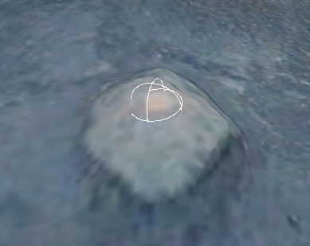

After placing your altitude marker, specify its real-world elevation in meters.

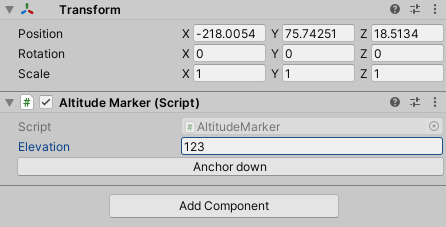

**Note:** The **"Anchor Down"** button allows your altitude marker to fall down to the nearest object (that has a collider) in your scene. It is simply for convenience and is optional to use.

By default, showing elevation data is turned off. To enable it, find the "**Settings**" object in the scene hierarchy, and enable "Show Elevation Data"

You should now see the elevation of your latest pole measurements.

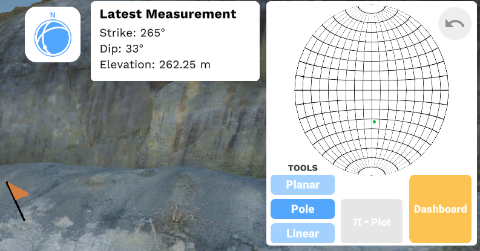

### (Optional) Enabling random sampling radius

To mitigate the effects of noise during your pole measurements, you can enable the sampling of multiple points around your clicks.

By default, random sampling is disabled. To enable it or to change its settings, go to the "Settings" object in your hierarchy view.

Next, go into play mode what start taking pole measurements! You will see white lines representing the extra measurements that are taking place and are averaged when plotting to the stereonet.

With the default settings, you should see something similar to this:

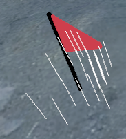

The white lines are the extra random samples taken in your measurement. These lines are rendered even when occluded by objects. 

**Note:** These white lines, in addition to other visuals that you see when "Gizmos" is enabled is only inside the editor, and not in the final build. Gizmos should already be enabled by default.

The "Gizmos" toggle in the top-right corner of your **game** tab (not the scene tab!). You should leave it enabled for both the scene and the game view. 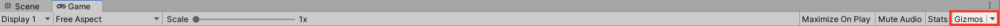

### (Optional) Setting up your map view

To select your map camera, expand the "Map View" object and select "Map View Camera"

[TODO]

In your scene view, move the this camera object

### (Optional) Using Popup UI Objects

**Adding hyperlinks to your text**

## Setting up the main menu

This package also includes a simple main menu screen. We will show how to change the title ands its subheading.

Open the scene called "Main menu" inside "Assets/Scenes"

In the hierarchy tab, open the "Manu Canvas" object to find the "Title" and "Sub header" text objects.

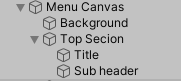

Once you select either the title of sub header, you will see a "**TextMeshPro**" component. Simply change the placeholder text.

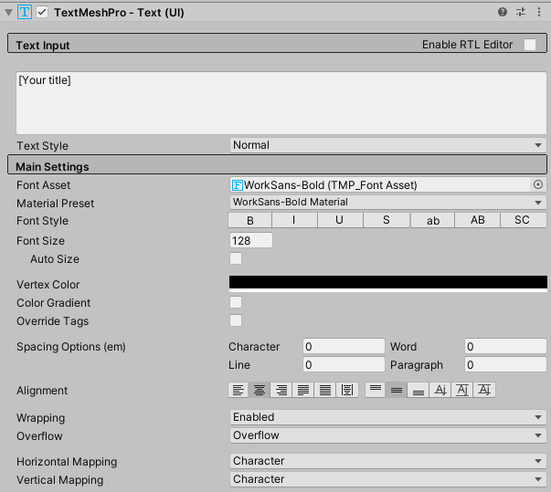

This scene also includes a simple acknowledgements page, named "Acknowledgements Canvas" in the hierarchy tab. We recommend temporarily disabling the Menu Canvas to better edit this page.

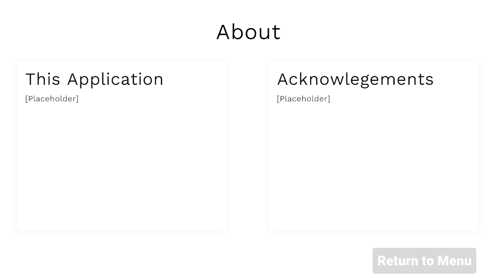

## Building to WebGL

It's very important that your build settings look exactly like in the screenshots below!

First, open the "Build Settings..." window

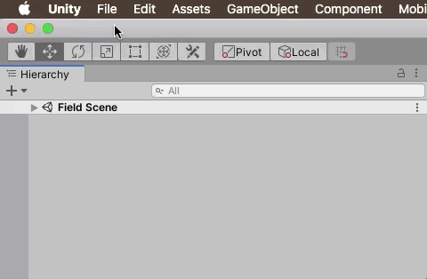

This is how your build settings should look. Build order is important for the main menu to work!

Select "Build" to build your project. When asked for a directory, we recommend storing it in a separate and empty folder outside of the project. You will later need to compress this folder to share it.

[TODO demonstration]

Note that building your project can be a slow process, taking several minutes. 

## Running your build locally

Roughly speaking, due to browser security concerns, WebGL games must be executed through a web server. Running your project locally will result in the game not loading!  Creating your own server or changing your browser's settings can be tedious for yourself and others that you plan to share it with.

With that, the best way to share WebGL games is to upload it online and share it privately or publicly. 

## Sharing your build

If you do not have your own domain/server to host your build, we recommend using the free hosting services [itch.io](https://itch.io) or [simmer.io](https://simmer.io). Both services have similar policies, so we will just cover itch.io below.

Here is the itch.io [FAQ for uploaders](https://itch.io/docs/creators/faq#what-does-itchio-give-me), but its most relevant points are:

- You keep ownership of your project. You can remove it at any time.
- You can restrict access to who can access your build, such as setting your build to be restricted and handing individual keys to people to access it. More on how access works [here](https://itch.io/docs/creators/access-control).

Below is a screenshot of the access options you can pick between when uploading to itch.io.

To upload it, you will need to compress your build folder. 

Here are the publishing settings we used in itch.io for our Whaleback project:

## Feedback

For any questions or feedback, please email [TODO]

