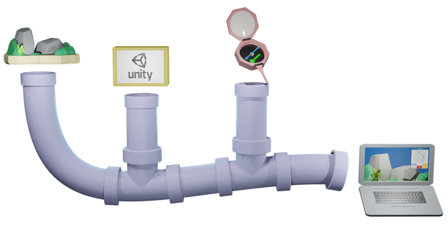
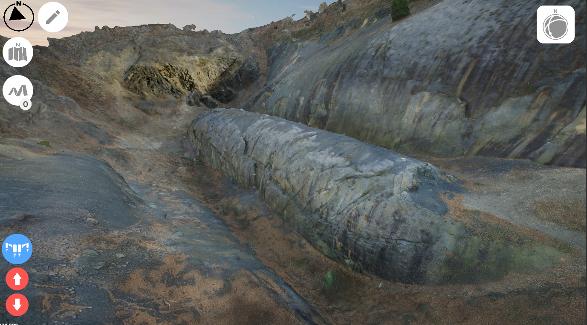
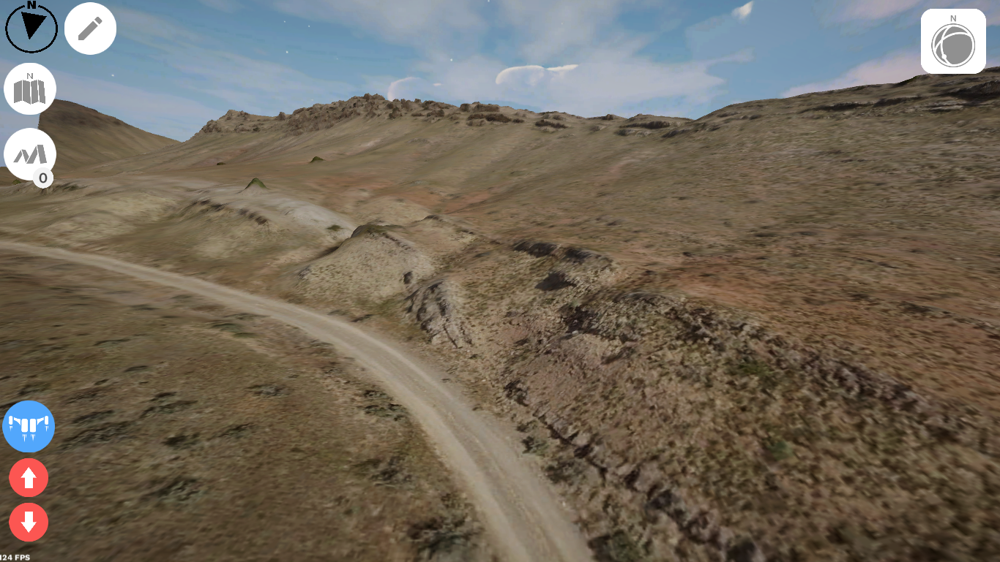

# Structural Geology Query Toolkit Instructions

|  |  |
| :----------------------------------------------------------: | :----------------------------------------------------------: |

Welcome to our workflow for generating a video-game-style virtual field experience in which you can interrogate outcrops with our structural-geology toolkit. Here we describe the step-by-step process of downloading the necessary software, setting up your geologic terrain model, and sharing the virtual field experience with the public.

### To learn how to build your own project, use the [wiki](https://github.com/UWRealityLab/StructuralQueryToolkit/wiki)

1. [Installing Unity](https://github.com/UWRealityLab/StructuralQueryToolkit/wiki/1.-Installing-Unity)
2. [Downloading and importing the Structural Query Toolkit Project](https://github.com/UWRealityLab/StructuralQueryToolkit/wiki/2.-Downloading-and-importing-the-Structural-Query-Toolkit-Project)
3. [Setting up the scene](https://github.com/UWRealityLab/StructuralQueryToolkit/wiki/3.-Setting-up-the-scene)
4. [Setting up the main menu](https://github.com/UWRealityLab/StructuralQueryToolkit/wiki/4.-Setting-up-the-main-menu)
5. [Settings](https://github.com/UWRealityLab/StructuralQueryToolkit/wiki/5.-Settings)
6. [Building to WebGL](https://github.com/UWRealityLab/StructuralQueryToolkit/wiki/6.-Building-to-WebGL)
7. [Running your build locally (not recommended)](https://github.com/UWRealityLab/StructuralQueryToolkit/wiki/7.-Running-your-build-locally-(not-recommended))
8. [Sharing your build](https://github.com/UWRealityLab/StructuralQueryToolkit/wiki/8.-Sharing-your-build)
9. [Feedback](https://github.com/UWRealityLab/StructuralQueryToolkit/wiki/9.-Feedback)

